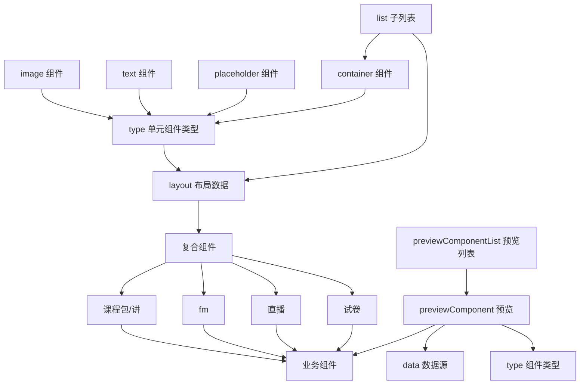

## 需求描述


### 专题模版重构第3.1期
#	运营后台部分

 ##	业务组件
|  组件   | 参数  | 工时 | 示例 | 备注  |
|  :---  | ----  |----  |----  |----  |
|  直播 | layout:配置布局参数<br/>formJson 右侧表单抽屉显示数据<br/>formProps 表单数据props |6  |----  |循环遍历渲染layout的数据<br/>同pictureComponent交互事件相同<br/>默认样式显示<br/>含分组  |
|  资讯  | 同上 |6  |----  |循环遍历渲染layout的数据<br/>同pictureComponent交互事件相同<br/>默认样式显示<br/>|
|  板报  | 同上 |6  |----  |循环遍历渲染layout的数据<br/>同pictureComponent交互事件相同<br/>默认样式显示<br/>|
|  测评  | 同上 |6  |----  |循环遍历渲染layout的数据<br/>同pictureComponent交互事件相同<br/>默认样式显示<br/>|


### 专题模版重构第二期


#	运营后台部分


## 路由


[列表模块](https://docs.qq.com/sheet/DVmRtdE5BZm9YdnJ1?tab=hkn9nh)


|  页面   | 路由  | 参数 | 服务 | owner | 备注 |
|  :---  | ----  |----  |----  |----  |----  |
| 专题模版编辑页  | /template/detail/:id | id 专题模版id ,新建为-1| 1.新增创建专题时获取一个专题id<br /> 2.删除绑定的数据源 |||

## 预览组件构成


  ##	基础单元组件
|  组件   | 参数  | 工时 | 示例 | 备注  |
|  :---  | ----  |----  |----  |----  |
|  Image  | dataKey: value对应的key<br/>data: 显示数据，对应settingList每个值的data<br/>styleJson：样式组合，对应dataKey<br/>props: prop的数据 |2  ||基于一期pictureComponent组件修改|
|  Text  | 同上 |2  |||
|  PlaceHolder  | 同上 |2  ||基于一期placeholder修改|
|  Container  | 同上<br/>renderItem:用于嵌套渲染组件，传承于ComplexComponent<br/>layout:用于布局的数据({type:组件名,list:[子组件]})<br/>isRoot: 布尔/是否是根组件 |6  ||基于一期pictureComponent组件修改|

 ##	复合组件
|  组件   | 参数  | 工时 | 示例 | 备注  |
|  :---  | ----  |----  |----  |----  |
|  复合ComplexComponent | 同container的入参 |6  |----  |循环遍历渲染layout的数据  |
| 分组GroupComponent | list: 分组{label:名称，key}<br/>onClick: (item) 切换列表显示数据 |8  |----  |分组组件  |


##	业务组件通用布局layout
| 样式形式 | 工时 | 示例 |
|  :---  | ----  |----  |
| 一行一图 |2  |`{type:'container',colProps:{span:24},list:[{type:'image'},{type:'text'}]}`  |
| 一行两图 | 2 |`{type:'container',colProps:{span:12},list:[{type:'image'},{type:'text'}]}`  |
| 一列多图 | 2 |`{type:'container',colProps:{span:24},list:[{type:'image'},{type:'text'}]}`  |

 ##	业务组件
|  组件   | 参数  | 工时 | 示例 | 备注  |
|  :---  | ----  |----  |----  |----  |
|  lesson 课程包/讲 | layout:配置布局参数<br/>formJson 右侧表单抽屉显示数据<br/>formProps 表单数据props |6  |----  |循环遍历渲染layout的数据<br/>同pictureComponent交互事件相同<br/>默认样式显示<br/>含分组  |
|  FM  | 同上 |6  |----  |循环遍历渲染layout的数据<br/>同pictureComponent交互事件相同<br/>默认样式显示<br/>|
|  试卷Paper| 同上 |6  |----  |循环遍历渲染layout的数据<br/>同pictureComponent交互事件相同<br/>默认样式显示<br/>含分组|
|  直播live| 同上 |6  |----  |循环遍历渲染layout的数据<br/>同pictureComponent交互事件相同<br/>默认样式显示<br/>|

 ##	页面构成组件样式修改
|  组件   | 功能 | 工时 | 示例 | 备注  |
|  :---  | ----  |----  |----  |----  |
|  组件选择列表  | 一列改为两列 |2  |  |  |
|  单个组件设置表单抽屉  | 右侧样式设置和页面设置改为并列 |2  |  |  |

## 总工时

60/小时

### 专题模版重构第一期

#	运营后台部分


## 路由


|  页面   | 路由  | 参数 | 服务 | owner | 备注 |
|  :---  | ----  |----  |----  |----  |----  |
| 专题模版编辑页  | /template/detail/:id | id 专题模版id ,新建为-1| 1.专题类型列表<br />2.保存专题<br />3.专题详情<br />4.上传图片 |||
|  专题模版预览页  | /template/preview/:id  |id 专题模版id  |1.专题模版详情  |  |  |


  ## 页面数据流向

  ```mermaid
  graph TB	
  A{TemplateEdit 专题模版编辑页}
  F[页面布局]-->A
  F2[右侧页面数据显示数据]-->F
  F1113n-->F2
  F1[左侧组件库显示数据]-->F
  F111[基本组件列表componentList]-->F1
  F1111[title :基本组件]-->F111
  F1112[key :标记值]-->F111
  F1113[list:组件列表 `nameList`]-->F111
  F1113n[单个组件配置数据]-->F1113
  F11131[name:组件名称]-->F1113n
  F11132[formProps:表单prop]-->F1113n
  F11133[formJson:表单配置化数据]-->F1113n
    B[组件库]-->A
    C[DragSortList]-->B
    C[DragSortList]-->D
    C1[DragItem]-->C
    D[SearchForm]-->B
    D1[ColorPicker]-->D
    D2[SliderInput]-->D
    D3[DragSortList]-->D
    D4[UploadImage]-->D
    
    E1[PreviewComponent]-->B
  
  A--新增-->G[页面编辑数据]
  A--编辑-->H11
  I[预览页面&显示页面]-->H11
  I1[组件库]-->I
  I11[PreviewComponentList]-->I1
  I12[ShareIcon]-->I1
  H11[详情接口返回数据流]-->A11[data.data]-->G
   G --> C11[分化`list,...pageData`]
      C11 --> D11[pageData 页面设置表单数据]
      C11 --> E11[list 组件管理数据]
      E11 --> F11[type:组件类型]
      E11 --> G11[data:组件设置数据]
  ```


  ##	页面构成

|  组件   | 功能 | 工时 | 示例 | 备注  |
|  :---  | ----  |----  |-  |----  |
|  头部组件  | [专题编辑页面/组件选择列表](http://zentao.mistong.com/index.php?m=task&f=view&taskID=21054) |2  |  |  |
|  组件选择列表  | 拖拽单个组件至画布<br />支持实时排序 |2  |  |基于DragSortList组件  |
|  中间画布  | 拖拽排序<br />滑入删除<br />双击显示组件设置表单抽屉<br />画布内滑动<br />首屏高度显示<br />页面标题根据页面设置标题实时变化 |8  |  |基于DragSortList组件<br />数据源为list  |
|  右侧sider/tab  | 切换页面设置/组件管理右侧显示页 |2  |  |  |
|  页面设置表单  | 用于页面设置数据修改<br />分享switch修改控制分享内容显示隐藏<br />页面标题输入与画布页面标题实时联动 |6  |  |基于SearchForm组件<br />数据源为pageData  |
|  组件管理列表  | 全部组件删除<br />拖拽排序<br />单个组件删除<br />所有删除都带有二次确认poperConfirm |6  |  |基于DragSortList开发<br />数据源为list  |
|  单个组件设置表单抽屉  | 画布组件双击显示该组件设置<br />实时数据联动 |2  |  |基于SearchForm组件  |


  ##	公用组件
|  组件   | 参数  | 工时 | 示例 | 备注  |
|  :---  | ----  |----  |----  |----  |
|  公用表单 SearchForm  | formJson: 数据源及配置<br />formProps: form表单prop<br />formType: 表单类型 支持form/search<br />initialValues: 表单初始值<br />onValuesChange: 数据发生变化回调<br />... |8  |  |基于ant-design form 二次封装<br />封入ColorPicker/SliderInput/UploadImage自定义组件  |
|  颜色选择ColorPicker  | value: 颜色值 hex<br />color:颜色值 hex<br />initialValue?: 初始颜色值 hex;<br />onChange: change回调事件 |2  |  |基于 react-color 二次封装  |
| 滑动输入SliderInput | value: number<br />onChange:change回调事件<br />props: 自定义组件prop |2 | |基于ant-design slider/input 封装 |
|  拖拽列表DragSortList  | list:数据源列表<br />showList:拖拽显示列表<br />dragType: 拖拽类型，用于drop的accept和drag的type<br />changeList: 修改数据源时间回调<br />notDrop: 是否只是单纯拖，该画布不用于排序 |8  |  |基于react-dnd 二次封装<br />渲染列表，具有拖拽排序功能  |
|  拖拽单个DragItem  | 同上<br />renderItem:渲染单个拖拽的ui<br />itemData:{item:{},index:number} 单个拖拽数据源 |6  |  |具有单个渲染拖拽内部功能  |
|  分享组件ShareIcon  |  |6  |  |分享显示组件<br />onClick 分享组件内容  |
|  主要渲染组件列表PreviewComponentList  | List:{type,data} 列表数据 |8  |  |根据数据显示组件列表<br />可内嵌于运营后台预览页面<br />与pc/h5显示项目通用  |
|  主要单个渲染组件PreviewComponent  | type 显示组件类型<br />data 显示组件数据 |8  |  |单个显示组件<br />可内嵌于编辑页面画布区<br />与pc/h5显示项目通用  |
|  上传图片UploadImage  | File 上传图片 |4  |----  |----  |


#	PC/h5项目/运营后台专题预览页
##	路由

|  页面   | 路由  | 参数 | 服务 | owner | 备注 |
|  :---  | ----  |----  |----  |----  |----  |
| 专题模版显示页  | /template/detail?id= | id 专题模版id | 1.专题详情 |||
|                |                      |               |            |        |  |

##	页面构成

|  组件   | 功能 | 工时 | 示例 | 备注  |
|  :---  | ----  |----  |-  |----  |
|  中间显示区  | 根据接口数据data.data.list {type, data}显示组件列表 |8  |  | 基于PreviewComponentList |
|  h5分享按钮  | h5显示分享，点击并分享 |4  |  |基于ShareIcon  |
|  Pc 右侧常驻功能  | 关注公众号、下载app、置顶（只有滑到第二屏才会显示出来） |6  |  |  |
| h5二维码生成  | 生成预览二维码  |2  |  |  |
| 运营后台预览tab切换  | 切换h5和pc预览  |2  |  |  |


